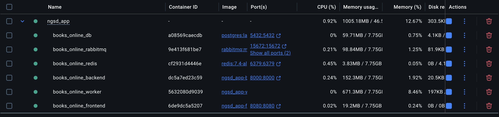
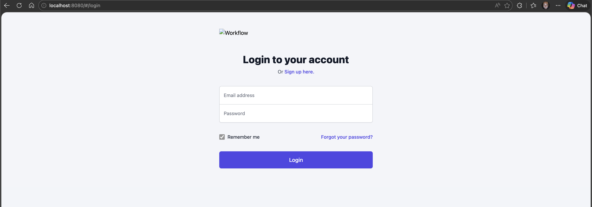
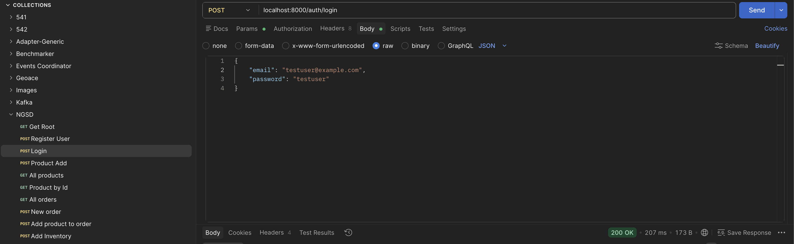

### Bookstore Online Exercise

## Technology Choices


For the project I selected the following technology stack:

- FastAPI / Python / Poetry

    I have been a Node.js advocate for some time prior my work with DTT, but have been studying more about FastAPI, and seeing the benchmarks, it makes better sense, since the uphand Node.js had regarding speed are now being exceded by FastAPI. I used to work in a way that processes that required more computational power were buit into python microservices, and have the rest be served via node js (in backend). But I have been working more with FastAPI and am very conviced it is the best option currently for web development. My Python backend experience was centered in Django and Flask before this. I am using Poetry for dependency and script management.

- Postgresql

     Basic relational database, with the capacity to support the concurrency that is expected.

- SqlAlchemy

     All models and db interactions are done using sqlalchemy.

- Alembic

     Per one of the requirements, in which management changes specifications constantly, being able to manage the database is of extreme importance. This includes progressive migrations and the ability to roll back to previous state with one command.

- Docker:
     The containers needed for deploying the application are executable using docker-compose


    Docker will then initialize the required (postgres, rabbitmq, redis, frontend, backend and one worker) containers to run the application. More workers can be added and deployed for scalability.

    


- Celery:
   I am including the possibility to delegate the order process, specially the order definition, which requires the most work, to one or multiple workers using Celery and Rabbitmq as a broker. This will distribute the workload between different nodes or servers, and the requirement of scalability can be met.My solution uses Rabbitmq as a broker and Redis as a backend.

## Prerequisites

A working Docker installation (including docker-compose)

## Setup

```bash
./init_containers.sh
```

This command will set up all needed docker containers.

Frontend is reachable through the browser, at:

http://localhost:8080

Backend is reachable at:

http://localhost:8000



A postman collection is available to test the backend.

NGSD.postman_collection.json



In order to test the endpoints, you must recover a login token to be used for authentication in the rest of the API, with the exception of the auth endpoints, register and login.
